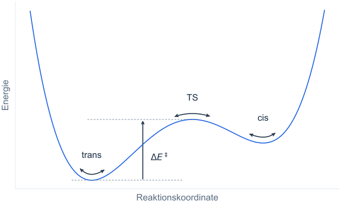

# Energien und Strukturoptimierung

## Molekulare Energien

Die Energie ist eine zentrale Größe der theoretischen Chemie. Sie hängt unter anderem von der Anordnung der
Atomkerne und der Verteilung der Elektronen ab. Neben anziehenden und abstoßenden Wechselwirkungen geht auch
die kinetische Energie der Elektronen in die Rechnung ein.

Die Webapp zeigt elektronische Energien einschließlich der im Modell berücksichtigten Lösungsmittelwirkung.
Die Werte sind häufig groß und negativ; ihr Nullpunkt hängt vom Rechenmodell ab. Für den Vergleich verschiedener
Strukturen sind deshalb die Energiedifferenzen entscheidend.

Verglichen werden Strukturen mit gleicher Zusammensetzung, die mit demselben Rechenmodell untersucht wurden,
beispielsweise die cis- und trans-Konfiguration desselben Azobenzolderivats. Die Struktur mit der niedrigeren
elektronischen Energie ist in diesem Vergleich energetisch günstiger.

Eine Energiedifferenz wird als Energie der Zielstruktur minus Energie der Ausgangsstruktur angegeben.
Ein Zahlenbeispiel verdeutlicht die Vorzeichenkonvention: Für die angenommenen Werte
$E_\mathrm{cis} = -932{,}48\ \text{eV}$ und
$E_\mathrm{trans} = -933{,}00\ \text{eV}$ ergibt sich für die Richtung von cis nach trans:

$$
\Delta E_{\mathrm{cis\to trans}} = E_\mathrm{trans} - E_\mathrm{cis} = -0{,}52\ \text{eV}.
$$

Das negative Vorzeichen bedeutet, dass die trans-Struktur um 0,52 eV niedriger liegt als die cis-Struktur.
Für die umgekehrte Richtung ist die Energiedifferenz positiv: +0,52 eV.

Energiedifferenzen können pro Molekül oder pro Mol angegeben werden. 1 eV pro Molekül entspricht etwa
96,49 kJ/mol. Die molare Energiedifferenz beträgt in diesem Beispiel daher:

$$
\Delta E_\mathrm{m} \approx -50\ \text{kJ mol}^{-1}.
$$

## Strukturoptimierung {#structure-optimization}

Moleküle können viele verschiedene räumliche Strukturen annehmen, die sich in ihren Atompositionen – und damit auch in
ihrer Energie – unterscheiden.
Einige dieser Strukturen entsprechen lokalen Energieminima; ihre Energie lässt sich durch kleine Auslenkungen der
Atomkoordinaten nicht weiter verringern.
Eine Minimumstruktur entspricht einem lokalen Minimum der Energiefläche.

Bei Azobenzol und seinen Derivaten gibt es Minima sowohl in der *cis*- als auch in der *trans*-Konfiguration.
Innerhalb einer Konfiguration können weitere Minima auftreten, etwa mit anders verdrehten Substituenten.
Eine Minimumsuche findet nicht zwangsläufig die Anordnung mit der insgesamt niedrigsten Energie.
Eine zentrale Aufgabe der computergestützten Chemie besteht darin, solche Minimumstrukturen zu finden und zu
charakterisieren – dieser Vorgang wird als Strukturoptimierung bezeichnet.

Ein Reaktionspfad beschreibt eine Folge von Molekülstrukturen, die Ausgangs- und Produktstruktur
miteinander verbindet. Die Reaktionskoordinate gibt die Position entlang dieses Pfads an,
nicht die verstrichene Zeit.

<figure markdown="1">

<figcaption markdown="1">
Das schematische Energieprofil zeigt die Energie entlang eines Reaktionspfads. *cis* und *trans* liegen in lokalen Minima.
Dazwischen liegt ein Maximum entlang des Wegs: die Übergangsstruktur (TS, englisch *transition structure*).
</figcaption>
</figure>

Im vollständigen Raum der Atomkoordinaten entspricht die gesuchte Struktur einem Sattelpunkt erster Ordnung:
Entlang einer inneren Bewegungsrichtung fällt die Energie auf beiden Seiten ab; in den übrigen inneren Richtungen
steigt sie bei kleinen Auslenkungen an. Die Webapp prüft diese Eigenschaft näherungsweise mit einer Schwingungsrechnung
und verfolgt anschließend beide Abwärtsrichtungen zu Minima. Reine Verschiebungen und Drehungen des ganzen Moleküls
werden bei der Schwingungsprüfung ausgeblendet.

Eine Schwingungsmode beschreibt ein gemeinsames Auslenkungsmuster der Atome.
Eine imaginäre Frequenz kennzeichnet eine instabile Mode: Bei kleinen Auslenkungen
entlang dieser Richtung nimmt die Energie am Sattelpunkt auf beiden Seiten ab.
Ein Sattelpunkt erster Ordnung besitzt genau eine solche unabhängige innere Mode.

Ergänzung: Übergangszustand oder Übergangsstruktur?

Die Übergangsstruktur ist die berechnete Molekülstruktur am Sattelpunkt der
Potentialenergiefläche. Diesen Begriff verwenden wir in der Webapp für das
geprüfte Ergebnis. Die Struktur ist kein langlebiges, isolierbares Zwischenprodukt.

Der Übergangszustand (englisch *transition state*) ist ein Begriff der
Übergangszustandstheorie. Er bezeichnet eine Menge von Zuständen an der Grenze
zwischen Edukten und Produkten, nicht nur eine einzelne Molekülstruktur.
Siehe die IUPAC-Begriffe [transition state](https://goldbook.iupac.org/terms/view/T06468)
und [transition structure](https://goldbook.iupac.org/terms/view/T06471).

Die elektronische Energiebarriere gegenüber einem Ausgangsminimum ist

$$
\Delta E^\ddagger = E_\mathrm{TS} - E_\mathrm{Minimum}.
$$

Sie charakterisiert den untersuchten Weg. Ein anderes Minimum oder ein anderer Weg kann eine andere Barriere
liefern. Die Barriere beeinflusst die Reaktionsgeschwindigkeit, bestimmt sie aber nicht allein.

Ergänzung: Energiebarriere und Aktivierungsenergie

Die Aktivierungsenergie $E_\mathrm{a}$ beschreibt, wie sich die Geschwindigkeitskonstante einer Reaktion
mit der Temperatur ändert. Sie ist nicht generell mit unserer elektronischen Energiebarriere
$\Delta E^\ddagger$ identisch. In der Übergangszustandstheorie wird die Geschwindigkeit über eine freie
Aktivierungsenergie $\Delta G^\ddagger$ beschrieben; darin gehen auch thermische Beiträge und Entropie ein.
Diese Größen berechnet die Webapp nicht. Siehe die [IUPAC-Definition der Aktivierungsenergie](https://goldbook.iupac.org/terms/view/A00102).

Die Rechnung untersucht außerdem nur den elektronischen Grundzustand. Bei Azobenzolen können
Wechsel zwischen Zuständen mit unterschiedlicher Elektronenspin-Anordnung (Singulett und Triplett)
zur thermischen Isomerisierung beitragen. Solche Zustandswechsel werden hier nicht berechnet.
Auch eine numerisch bestätigte Übergangsstruktur belegt deshalb nicht den experimentell maßgeblichen
Reaktionsweg oder die Lebensdauer der cis-Form.

