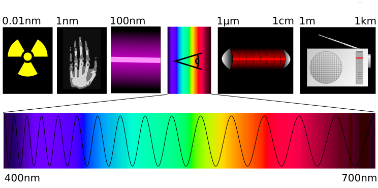
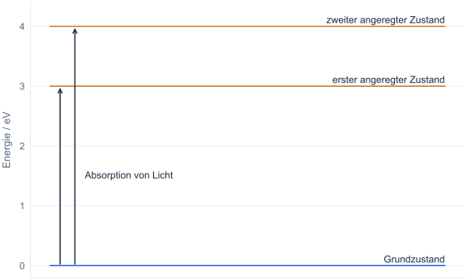
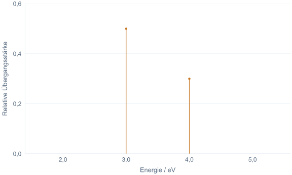
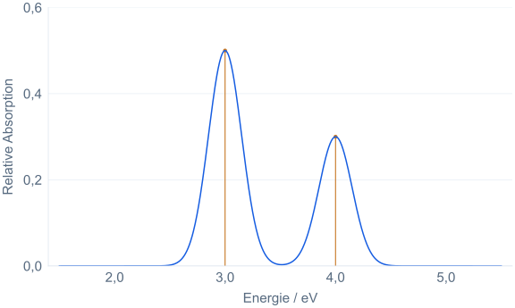
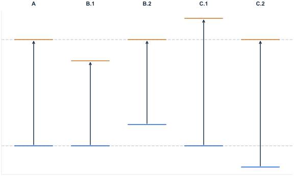
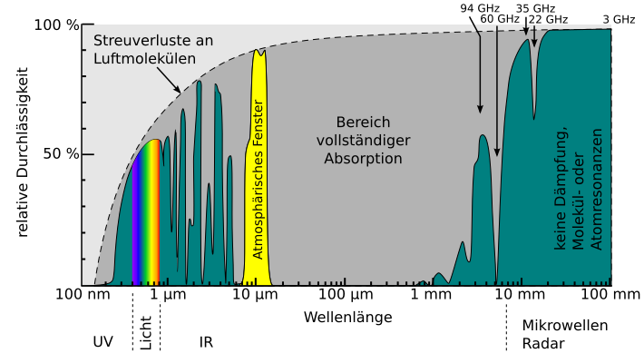

# Licht und Absorption

## Das elektromagnetische Spektrum

Sichtbares Licht umfasst einen kleinen Bereich des elektromagnetischen Spektrums.
Dieses umfasst alle Formen elektromagnetischer Strahlung – von energiearmen Radiowellen über Mikrowellen und
Infrarotstrahlung bis hin zu sichtbarem Licht, UV-Strahlung, Röntgenstrahlen und hochenergetischen Gammastrahlen.

Die einzelnen Bereiche unterscheiden sich in der Energie $E$ eines Lichtquants (Photons) und seiner Wellenlänge $\lambda$.
Für ein Photon gilt: Je höher die Energie, desto kürzer die Wellenlänge im Vakuum.
Dies wird durch folgende Gleichung beschrieben:

$$
E = \frac{hc}{\lambda}\,,
$$

wobei $h$ die Planck-Konstante und $c$ die Lichtgeschwindigkeit im Vakuum ist.
Das Produkt der beiden Konstanten beträgt

$$
hc \approx 1{,}9864 \times 10^{-25}\;\text{J m} \;\;\approx\;\; 1239{,}8\;\text{eV nm}.
$$

Ein Elektronenvolt (eV) ist eine Energieeinheit: 1 eV ≈ 1,602 × 10⁻¹⁹ J.
Ein Nanometer (nm) ist ein Milliardstel Meter: 1 nm = 10⁻⁹ m. Mit diesen Einheiten
lassen sich die hier betrachteten Photonenenergien und Wellenlängen ohne sehr kleine Dezimalzahlen angeben.

<figure markdown="1">

<figcaption markdown="1">
Das elektromagnetische Spektrum. Die obere Reihe zeigt (von links nach rechts) stilisierte Darstellungen von
Gammastrahlen, Röntgenstrahlen, UV-Strahlung, sichtbarem Licht, Infrarotstrahlung, Mikrowellen und Radiowellen.
Die untere Reihe vergrößert den sichtbaren Teil des Spektrums.
Tatoute und Phrood~commonswiki, Lizenz: [CC BY-SA 3.0](https://creativecommons.org/licenses/by-sa/3.0/). Quelle: [Wikimedia Commons](https://commons.wikimedia.org/wiki/File:Spectre.svg).
</figcaption>
</figure>

## Absorption elektromagnetischer Strahlung {#light-absorption}

Moleküle können mit Licht wechselwirken, indem sie dieses absorbieren. Wie diese Wechselwirkung abläuft, wird durch die
Gesetze der Quantenmechanik beschrieben.
Moleküle besitzen bestimmte, erlaubte Energiezustände. Bei der Absorption eines Photons geht ein Molekül in einen energetisch
höheren Zustand über. Die Energie des Photons entspricht dabei der Energiedifferenz zwischen den beiden Zuständen.
Nicht jeder energetisch passende Übergang ist gleich wahrscheinlich: Manche tragen stark, andere kaum zur Absorption bei.
Schematisch lässt sich dieser Prozess wie folgt darstellen:

<figure markdown="1">

<figcaption markdown="1">
Vereinfachtes Energieniveauschema eines Absorptionsprozesses.
Das (fiktive) Molekül kann entweder Licht mit 3,0 eV oder 4,0 eV absorbieren, um in den ersten bzw. zweiten angeregten
Zustand versetzt zu werden.
</figcaption>
</figure>

Für eine festgehaltene Molekülgeometrie liefert die im Versuch verwendete Rechnung einzelne elektronische Übergänge.
Trägt man ihre Energien und Stärken auf, erhält man das folgende Linienspektrum.

<figure markdown="1">

<figcaption markdown="1">
Schematisches Linienspektrum mit elektronischen Übergängen bei 3,0 eV und 4,0 eV.
Die Linienhöhen zeigen relative Übergangsstärken.
</figcaption>
</figure>

UV/Vis-Spektren von Molekülen in Lösung zeigen meist breite Absorptionsbanden. Dazu tragen viele nahe beieinanderliegende
Übergänge mit unterschiedlichen Schwingungszuständen sowie Wechselwirkungen mit der Umgebung bei.
Auch die endliche Lebensdauer angeregter Zustände und die Auflösung des Messgeräts beeinflussen die Linienbreite.
Die Webapp bildet diese Effekte vereinfacht ab: Sie ersetzt jede berechnete Linie durch eine Gaußkurve mit
vorgegebener Breite und addiert die Beiträge. Die Breite selbst wird nicht aus Molekülbewegungen berechnet.

Es entsteht ein Bandenspektrum.
Die Bandenlagen zeigen, welche Anregungsenergien zur Absorption beitragen.
Ihre relativen Höhen hängen von den Übergangsstärken und der Überlagerung benachbarter Banden ab.

<figure markdown="1">

<figcaption markdown="1">
Das Bandenspektrum eines Moleküls, das bevorzugt Licht mit 3,0 eV und 4,0 eV absorbiert.
Zur besseren Orientierung wurde das zugrunde liegende Linienspektrum im Hintergrund dargestellt.
</figcaption>
</figure>

Ergänzung: Absorption, Transmission und Oszillatorstärke

**Absorption** ist die Aufnahme von Strahlungsenergie. Die **Transmission** $T = I/I_0$ gibt an,
welcher Anteil der einfallenden Lichtintensität $I_0$ als Intensität $I$ durch eine Probe hindurchtritt.
Die dekadische **Absorbanz** ist $A = -\log_{10}(T)$. Für geeignete verdünnte Lösungen ist sie nach dem
Lambert-Beer-Gesetz proportional zur Konzentration und zur durchstrahlten Schichtdicke.
In Praktika wird dafür oft auch „Extinktion“ gesagt; dieser Begriff kann jedoch zusätzlich Streuverluste einschließen.
Siehe die [IUPAC-Definition der Absorbanz](https://goldbook.iupac.org/terms/view/A00028).

Die Rechnung liefert **Oszillatorstärken**: dimensionslose Maße für die Stärke elektronischer Übergänge.
Sie sind keine Absorptionswahrscheinlichkeiten zwischen 0 und 1 und keine Absorbanzwerte einer konkreten Probe.
Die Kurve in der Webapp zeigt daraus gebildete relative Absorptionsbanden. Für eine gemessene Absorbanz wären
zusätzlich unter anderem Konzentration und Schichtdicke nötig.

### Einfluss der Substituenten auf die Absorption

Substituenten verändern die Elektronenverteilung und können Grundzustand und angeregte
Zustände unterschiedlich beeinflussen. Wird die Energiedifferenz zwischen zwei Zuständen
kleiner, verschiebt sich der zugehörige Übergang zu längeren Wellenlängen (**bathochrom**).
Eine größere Energiedifferenz entspricht kürzeren Wellenlängen (**hypsochrom**).
Das Absorptionsmaximum hängt zusätzlich von den Oszillatorstärken und der Überlagerung
der verbreiterten Übergänge ab.

Ein **Orbital** beschreibt im Modell den räumlichen Zustand eines Elektrons. Daraus lässt
sich ableiten, mit welcher Wahrscheinlichkeit das Elektron in einem bestimmten Raumbereich
gefunden wird. Ein **π-System** entsteht durch die seitliche Überlappung benachbarter
p-Orbitale. Dabei können Elektronen über mehrere Atome verteilt sein; dies wird als
**Delokalisierung** bezeichnet. Sie kann die Anregungsenergie verringern. Substituenten
können aber auch die Geometrie und damit die Wechselwirkung zwischen den Molekülteilen verändern.

<figure markdown="1">

<figcaption markdown="1">
Einfluss von Substituenten auf die Anregungsenergie: A zeigt das Vergleichssystem,
B.1 und B.2 kleinere, C.1 und C.2 größere Energiedifferenzen. Die vertikalen Pfeile
stehen für die Anregungsenergien. Die Höhen der Niveaus sind keine direkt vergleichbaren
Gesamtenergien verschiedener Moleküle.
</figcaption>
</figure>

Ergänzung: Motivation – Das elektromagnetische Fenster der Atmosphäre

Absorptionsspektren spielen nicht nur bei der Charakterisierung einzelner Moleküle eine Rolle, sondern sind auch
entscheidend für das Verständnis des Energiehaushalts unserer Erde – und damit des Klimawandels.

Eines der wichtigsten Beispiele ist das Absorptionsspektrum unserer Atmosphäre. Die folgende Darstellung zeigt die
relative Durchlässigkeit (Transmission) für elektromagnetische Strahlung.
Bereiche mit hoher Durchlässigkeit heißen **atmosphärische Fenster**. Sonnenlicht und die Wärmestrahlung der Erde liegen dabei in unterschiedlichen Wellenlängenbereichen.

<figure markdown="1">

<figcaption markdown="1">
Atmosphärische Durchlässigkeit. PNG-Version: Herbertweidner; SVG-Umsetzung: Cepheiden. Quelle/Lizenz: [Wikimedia Commons](https://commons.wikimedia.org/wiki/File:Atmosph%C3%A4rische_Durchl%C3%A4ssigkeit_DE.svg).
</figcaption>
</figure>

Ein großer Teil des sichtbaren Sonnenlichts kann die Atmosphäre durchdringen. Die deutlich kühlere Erde gibt
Energie dagegen vor allem als langwellige Infrarotstrahlung ab. Ein anderes, infrarotes Fenster lässt einen Teil
dieser Wärmestrahlung ins Weltall entweichen. Treibhausgase absorbieren in Teilen des Infrarotbereichs und verändern
so den Energieaustausch. Sichtbares Licht und terrestrische Wärmestrahlung passieren also unterschiedliche
Spektralbereiche. Eine Einführung bietet die [NASA zum Strahlungshaushalt der Erde](https://science.nasa.gov/ems/13_radiationbudget/).

