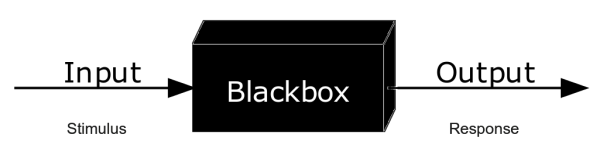

# Theoretische Chemie

Die theoretische Chemie untersucht chemische Fragestellungen mithilfe mathematischer Beschreibungen und
computergestützter Verfahren. Sie ergänzt experimentelle Untersuchungen, indem sie beispielsweise
Molekülstrukturen, Energien, Spektren oder Reaktionswege beschreibt und überprüfbare Vorhersagen ermöglicht.
Zum Fachgebiet gehören grundlegende Theorien wie die Quantenmechanik und die statistische Mechanik,
quantitative Berechnungen und Simulationen sowie vereinfachte qualitative Modelle.

Dieser Praktikumsversuch bietet einen ersten anwendungsbezogenen Einblick in das Fachgebiet. Die mathematischen
Grundlagen und die Herleitung der verwendeten Verfahren sind nicht Bestandteil des Versuchs. Sie werden im
weiteren Studium der theoretischen Chemie vertieft: im 3. oder 4. Semester sowie in einem optionalen Modul im
5. oder 6. Semester. Die Zuordnung richtet sich jeweils danach, ob das Studium im Winter- oder Sommersemester
begonnen wurde. Weitere Lehrveranstaltungen folgen im Masterstudium.

## Rechenmodelle

Ein Rechenmodell bildet gezielt diejenigen Eigenschaften eines Moleküls ab, die für eine bestimmte Fragestellung
benötigt werden. Andere Eigenschaften werden vereinfacht oder nicht berücksichtigt. Ein Modell ist daher keine
vollständige Kopie des untersuchten Moleküls, sondern eine festgelegte Beschreibung mit bekannten Annahmen.

Jede Rechnung verwendet definierte Eingaben, etwa eine Molekülstruktur, und liefert bestimmte Ergebnisse wie
eine optimierte Geometrie, eine Energiedifferenz oder ein Spektrum. Die folgende Abbildung stellt diesen
Zusammenhang als *Blackbox* dar: Das Rechenverfahren zwischen Eingabe und Ausgabe ist darin nicht im Detail gezeigt.

<figure markdown="1">

<figcaption markdown="1">
Krauss, Lizenz: [CC BY-SA 4.0](https://creativecommons.org/licenses/by-sa/4.0/). Quelle: [Wikimedia Commons](https://commons.wikimedia.org/wiki/File:Blackbox3D.png).
</figcaption>
</figure>

Dasselbe Molekül kann je nach gesuchter Größe mit unterschiedlichen Modellen untersucht werden. Die optionalen
Methodenabschnitte in der Webapp erläutern, wie die jeweiligen Programme aus den Eingaben Ergebnisse erzeugen,
welche numerischen Prüfungen sie ausführen und welche Annahmen für die Darstellung gelten.

## Aussagekraft

Wie genau ein konkretes Ergebnis ist, hängt von der Methode, der untersuchten Eigenschaft und dem Molekül ab.
Aufwendigere Verfahren können zusätzliche Wechselwirkungen berücksichtigen, benötigen aber meist mehr Rechenzeit.
Sie liefern für eine bestimmte Fragestellung nicht automatisch genauere Ergebnisse; eine längere Rechenzeit allein
belegt keine höhere Genauigkeit.

Viele Rechenverfahren bestimmen ein Ergebnis schrittweise. Numerische Konvergenz bedeutet, dass sich die berechneten
Werte innerhalb festgelegter Kriterien nicht mehr wesentlich ändern. Sie zeigt, dass das Verfahren ein numerisch
stabiles Ergebnis erreicht hat. Daraus folgt jedoch nicht, dass das verwendete Modell alle relevanten physikalischen
Effekte erfasst oder dass das Ergebnis mit einem Experiment übereinstimmt.

Dieser Versuch verwendet schnelle Näherungsverfahren. Berechnete Energieunterschiede und Bandenlagen können
deshalb merklich vom Experiment abweichen. Auch relative Verschiebungen der Absorptionsmaxima innerhalb einer
Reihe unterschiedlich substituierter Azobenzole sind Vorhersagen des verwendeten Modells. Ob ein berechneter
Trend das Verhalten der untersuchten Moleküle wiedergibt, muss durch Experimente oder geeignete
Referenzrechnungen geprüft werden.
