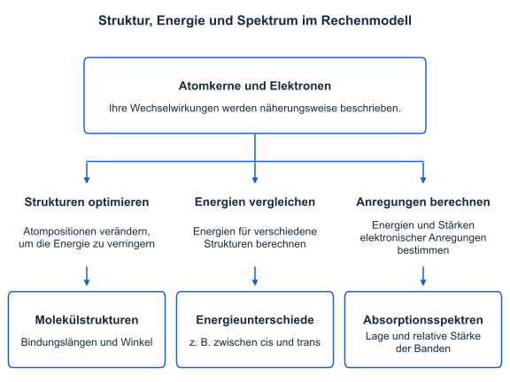
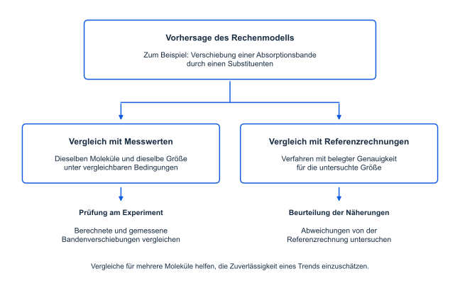

# Theoretische Chemie

Die theoretische Chemie untersucht chemische Fragestellungen mithilfe mathematischer Beschreibungen und
computergestützter Verfahren. Sie ergänzt experimentelle Untersuchungen, indem sie beispielsweise
Molekülstrukturen, Energien, Spektren oder Reaktionswege beschreibt und überprüfbare Vorhersagen ermöglicht.
Zum Fachgebiet gehören grundlegende Theorien wie die Quantenmechanik und die statistische Mechanik,
quantitative Berechnungen und Simulationen sowie vereinfachte qualitative Modelle.

Dieser Praktikumsversuch bietet einen ersten anwendungsbezogenen Einblick in das Fachgebiet. Die mathematischen
Grundlagen und die Herleitung der verwendeten Verfahren sind nicht Bestandteil des Versuchs. Sie werden im
weiteren Studium der theoretischen Chemie vertieft: im 3. oder 4. Semester sowie in einem optionalen Modul im
5. oder 6. Semester. Die Zuordnung richtet sich jeweils danach, ob das Studium im Winter- oder Sommersemester
begonnen wurde. Weitere Lehrveranstaltungen folgen im Masterstudium.

## Mathematische Beschreibung

Eine Strukturformel zeigt, welche Atome miteinander verbunden sind. Um Bindungslängen, Energien oder
Absorptionsspektren zu berechnen, braucht man zusätzlich eine physikalische Beschreibung des Moleküls.
Für die hier untersuchten Eigenschaften bildet die Quantenmechanik die Grundlage. Sie beschreibt die möglichen
Zustände der Elektronen und Atomkerne sowie deren Energien und Wechselwirkungen.

Die quantenchemischen Rechnungen dieses Versuchs beschreiben die Elektronen bei vorgegebenen Positionen der
Atomkerne. Ändert sich deren Anordnung, ändern sich auch die Wechselwirkungen und die berechnete Energie.
So lassen sich verschiedene räumliche Strukturen desselben Moleküls miteinander vergleichen. Die Beschreibung
elektronischer Zustände ermöglicht außerdem die Berechnung der Lichtabsorption. Struktur, Energie und Spektrum
werden dadurch über dieselben physikalischen Grundlagen miteinander verknüpft.

<figure markdown="1">

<figcaption markdown="1">
Die Beschreibung von Atomkernen und Elektronen verbindet den molekularen Aufbau mit den im Versuch berechneten
Größen.
</figcaption>
</figure>

## Rechenmodelle

Für Moleküle wie Azobenzol lassen sich die quantenmechanischen Gleichungen nicht exakt lösen. Für praktisch
durchführbare Rechnungen werden deshalb Näherungen benötigt. Ein Rechenmodell legt fest, wie das Molekül und
gegebenenfalls seine Umgebung beschrieben werden und welche Vereinfachungen dabei gelten. Ein Rechenverfahren
bestimmt daraus näherungsweise die gesuchten Größen.

Die Wahl des Modells richtet sich nach der Fragestellung. Eine Beschreibung, die Bindungslängen gut wiedergibt,
muss nicht ebenso genaue Absorptionsenergien liefern. Im Versuch werden deshalb für Strukturen und Spektren
unterschiedliche Näherungsverfahren eingesetzt. Die Programme und ihre konkreten Annahmen werden in den optionalen
Methodenabschnitten der Webapp erläutert.

## Berechnete Größen im Versuch

An Azobenzol untersuchen Sie drei zusammenhängende Aspekte: Die Strukturoptimierung sucht eine räumliche Anordnung
mit lokal niedriger elektronischer Energie. Der Vergleich der cis- und trans-Minimumstrukturen zeigt, welche von
beiden im verwendeten Modell die niedrigere elektronische Energie besitzt. Die Untersuchung eines Reaktionspfads
ergänzt diesen Vergleich um die elektronische Energiebarriere zwischen den beiden Konfigurationen.

Die Spektrenrechnung untersucht dagegen die Aufnahme von Licht. Sie liefert Energien und relative Stärken
elektronischer Anregungen, aus denen ein Absorptionsspektrum dargestellt wird. Durch den Vergleich unterschiedlich
substituierter Azobenzole untersuchen Sie, wie Veränderungen des molekularen Aufbaus mit Veränderungen der
Absorption zusammenhängen. Die folgenden Kapitel erläutern die dafür benötigten Begriffe und Größen.

## Vorhersagen und Prüfung

Theoretische Rechnungen helfen, experimentelle Beobachtungen zu erklären und neue Untersuchungen zu planen.
Sie können beispielsweise vorhersagen, wie sich eine Absorptionsbande durch eine Substitution verschiebt,
bevor das betreffende Molekül hergestellt und vermessen wurde. Dafür müssen die verglichenen Moleküle,
die berechnete Größe und die Annahmen der Rechnung angegeben werden.

<figure markdown="1">

<figcaption markdown="1">
Der Vergleich mit Messwerten prüft die Übereinstimmung mit dem Experiment. Referenzrechnungen mit Verfahren,
deren Genauigkeit für die untersuchte Größe gut belegt ist, helfen, die gewählten Näherungen zu beurteilen.
</figcaption>
</figure>

Die Genauigkeit muss für die jeweilige Größe und die untersuchten Moleküle beurteilt werden. Ein Modell kann
beispielsweise die Verschiebung einer Absorptionsbande gut wiedergeben, obwohl die berechneten Bandenlagen von
den gemessenen abweichen. Ob es einen solchen Trend zuverlässig beschreibt, lässt sich erst durch Vergleiche
für mehrere Moleküle beurteilen.

Im Versuch entwickeln Sie aus Ihren berechneten Spektrenreihen eine begründete Vermutung für ein weiteres
Derivat und prüfen sie mit einer neuen Rechnung. Damit untersuchen Sie, ob sich der beobachtete Zusammenhang
innerhalb des verwendeten Modells auf dieses Derivat übertragen lässt. Die Übereinstimmung mit einer solchen
Vermutung ist noch keine experimentelle Bestätigung des Trends.
