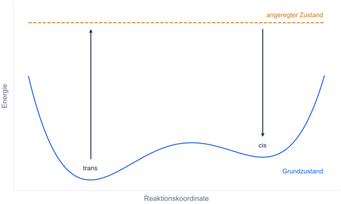

# Funktionsweise von Photoschaltern

## Lichtinduzierte Isomerisierung

Ein molekularer Photoschalter kann durch Licht zwischen Formen mit unterschiedlichen Eigenschaften wechseln.
Bei Azobenzol sind dies die *cis*- und die *trans*-Form. Lichtabsorption eröffnet einen Reaktionsweg über
angeregte elektronische Zustände.

Die lichtinduzierte Isomerisierung lässt sich vereinfacht in folgende Schritte gliedern:

1. Das Molekül liegt beispielsweise in der *trans*-Form im elektronischen Grundzustand vor.
2. Es absorbiert ein Photon geeigneter Energie und gelangt in einen angeregten elektronischen Zustand.
3. Im angeregten elektronischen Zustand können sich die Atompositionen verändern, etwa durch Verdrehung oder
   Änderung von Bindungswinkeln an der Azogruppe.
4. Das Molekül kehrt in den elektronischen Grundzustand zurück. Es kann dabei die *cis*-Form erreichen
   oder wieder die *trans*-Form annehmen. Eine Lichtabsorption führt daher nicht zwangsläufig zur Isomerisierung.

<figure markdown="1">

<figcaption markdown="1">
Stark vereinfachtes Schema der lichtinduzierten Isomerisierung. Die gestrichelte Linie deutet einen
angeregten Zustand an; sie ist keine berechnete Potentialenergiekurve. Die thermische Rückreaktion
im Grundzustand ist hier nicht eingezeichnet.
</figcaption>
</figure>

## Thermische Rückreaktion

Auch ohne Licht kann *cis*-Azobenzol thermisch zur *trans*-Form zurückkehren.
Dabei wird eine Energiebarriere überwunden. Wie schnell dies geschieht, hängt unter anderem
von Temperatur, Substituenten und Umgebung ab.

$RT$ ist eine thermische Energieskala pro Mol; $R$ ist die Gaskonstante und $T$ die absolute
Temperatur in Kelvin. Bei 298 K beträgt sie etwa 2,5 kJ/mol. Der Vergleich einer molaren Barriere
mit $RT$ zeigt, wie groß sie gegenüber dieser Energieskala ist. Unter sonst gleichen Bedingungen
sind höhere Barrieren thermisch schwerer zu überwinden. Moleküle tauschen jedoch ständig Energie
mit ihrer Umgebung aus; $RT$ ist keine Obergrenze ihrer Energie. Das Verhältnis allein gibt deshalb
nicht an, wie schnell eine Probe zur *trans*-Form zurückkehrt.

## Zusammensetzung unter Bestrahlung

In einer Mischung können sowohl *cis*- als auch *trans*-Moleküle Licht absorbieren.
Die Wellenlänge beeinflusst, welche Form bei gleicher Molekülzahl stärker angeregt wird.
Wie häufig daraus eine Umwandlung entsteht, hängt zusätzlich davon ab, welcher Anteil der
angeregten Moleküle die jeweils andere Konfiguration erreicht. Gleichzeitig kann die thermische
Rückreaktion zur *trans*-Form beitragen.

Bei gleichbleibender Bestrahlung und Temperatur kann sich eine konstante Zusammensetzung einstellen:
Pro Zeit werden dann gleich viele Moleküle von *trans* nach *cis* wie von *cis* nach *trans* umgewandelt.
Dieser Zustand heißt photostationär. Das Verhältnis der beiden Formen ergibt sich aus dem Zusammenspiel
der Hin- und Rückreaktionen, nicht allein aus der Lage ihrer Absorptionsmaxima.

## Beitrag der Rechnungen

Die Minimum- und Übergangsstruktursuche untersucht die
Abhängigkeit der elektronischen Grundzustandsenergie von den Atompositionen. Die UV/Vis-Rechnung liefert
Anregungsenergien und Übergangsstärken bei festgehaltener Struktur. Diese Ergebnisse beschreiben ausgewählte
energetische und spektroskopische Eigenschaften der Photoschalter. Der zeitliche Ablauf und die Ausbeute
der lichtinduzierten Isomerisierung werden damit nicht berechnet.
