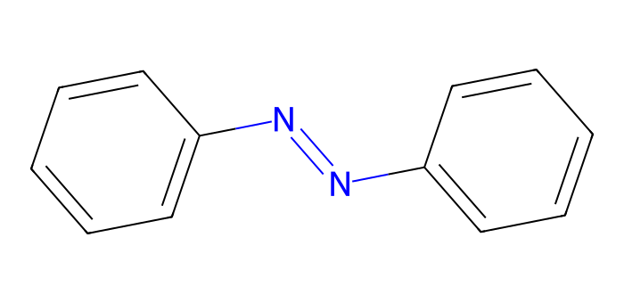
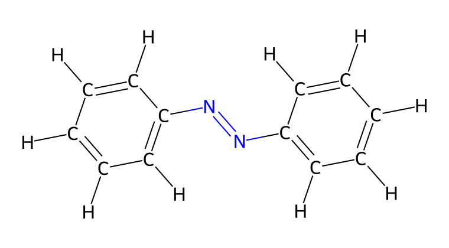
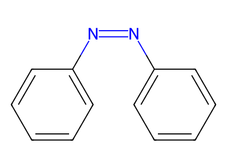
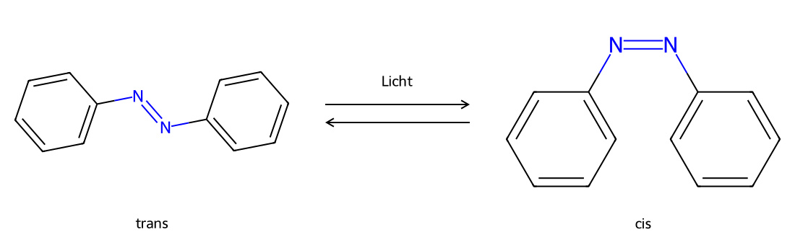
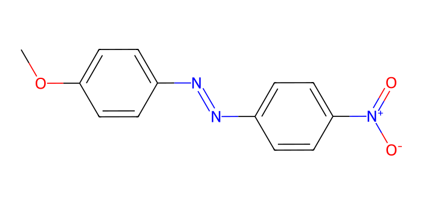
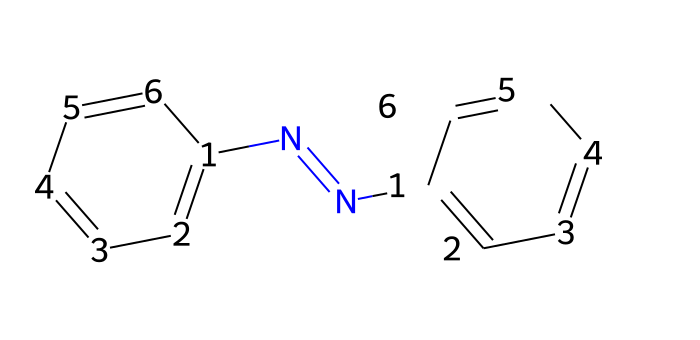
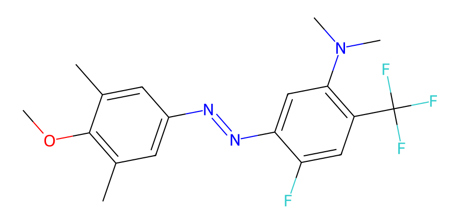

# Molekülstruktur und Isomerie

## Azobenzol {#molecular-structures}

In diesem Versuch arbeiten Sie mit dem Molekül Azobenzol.
Es besteht aus zwei Phenylgruppen, die über eine Azogruppe (–N=N–) miteinander verbunden sind.

<figure markdown="1">

<figcaption markdown="1">
Azobenzol, dargestellt als Skelettformel.
</figcaption>
</figure>

Ergänzung: Summen-, Struktur- und Skelettformeln

Azobenzol besteht aus 12 Kohlenstoff-, 10 Wasserstoff- und 2 Stickstoffatomen und besitzt somit die Summenformel
C₁₂H₁₀N₂.

In den beiden Phenylringen ist jedes Kohlenstoffatom mit zwei weiteren Kohlenstoffatomen verbunden. Je ein
Kohlenstoffatom pro Ring bindet die Azogruppe. Die übrigen Kohlenstoffatome tragen jeweils ein Wasserstoffatom.

Die genauen Bindungsverhältnisse lassen sich mit einer Strukturformel darstellen:

<figure markdown="1">

<figcaption markdown="1">
Die Strukturformel des Azobenzols.
</figcaption>
</figure>

Organische Moleküle besitzen häufig ein Grundgerüst aus Kohlenstoffatomen. In der Skelettformel werden die
Elementsymbole der Kohlenstoffatome und die daran gebundenen Wasserstoffatome zur besseren Übersicht weggelassen. Kohlenstoffatome liegen dann an den unbeschrifteten Ecken und Enden
der gezeichneten Bindungen; die gebundenen Wasserstoffatome werden so ergänzt,
dass Kohlenstoff insgesamt vier Bindungen eingeht.

## Konfigurationsisomerie

Durch die Azogruppe kann Azobenzol in zwei unterschiedlichen räumlichen Anordnungen (Konfigurationen) vorliegen.
Die oben gezeigte Struktur entspricht der *trans*-Form, bei der die beiden Phenylringe auf gegenüberliegenden
Seiten der Azogruppe stehen.
Bei der *cis*-Form befinden sich beide Ringsysteme auf derselben Seite.

Ergänzung: *E*,*Z*-Nomenklatur

Die systematische *E*,*Z*-Nomenklatur beschreibt die Anordnung an einer Doppelbindung anhand der Priorität der
gebundenen Gruppen. Liegen die Gruppen mit höherer Priorität auf entgegengesetzten Seiten, lautet der Deskriptor *E*
(von *entgegen*); liegen sie auf derselben Seite, lautet er *Z* (von *zusammen*). Dieses Verfahren bleibt auch bei
unterschiedlichen gebundenen Gruppen eindeutig und ist daher allgemeiner und genauer als die Bezeichnungen *cis* und
*trans*.

Beim Azobenzol beschreiben *trans* und *cis* anschaulich, ob die beiden Phenylringe auf gegenüberliegenden Seiten oder
auf derselben Seite der Azogruppe liegen. Diese Bezeichnungen sind für Azobenzole gebräuchlich und werden im gesamten
Versuch sowie in der Webapp einheitlich verwendet. Dabei entspricht *trans* der *E*- und *cis* der *Z*-Konfiguration.

Moleküle mit gleicher Summenformel und Molekülmasse, die sich jedoch in der räumlichen Anordnung oder Verknüpfung der
Atome unterscheiden, bezeichnet man als Isomere.

<figure markdown="1">

<figcaption markdown="1">
*Cis*-Azobenzol.
</figcaption>
</figure>

Bei Azobenzol liegt die *trans*-Form energetisch tiefer als die *cis*-Form.
Ohne Bestrahlung überwiegt sie im thermischen Gleichgewicht bei Raumtemperatur.
Durch Bestrahlung mit Licht geeigneter Wellenlänge kann jedoch eine Umwandlung in die *cis*-Form ausgelöst werden.
Diese lichtinduzierte Isomerisierung bildet die Grundlage für die photoschaltbaren Eigenschaften des Moleküls.

Die beiden Formen unterscheiden sich darin, bei welchen Wellenlängen und wie stark sie Licht absorbieren.
Welche Mischung unter Bestrahlung entsteht,
hängt unter anderem von der Wellenlänge ab; eine vollständige Umwandlung ist nicht garantiert.

<figure markdown="1">

<figcaption markdown="1">
Die lichtinduzierte Isomerisierung des Azobenzols.
</figcaption>
</figure>

Ergänzung: Dreidimensionale Visualisierung

Chemische Strukturformeln eignen sich gut zur Darstellung grundlegender räumlicher Eigenschaften wie der
*cis*-*trans*-Isomerie, sind jedoch durch ihre zweidimensionale Darstellung begrenzt.
Abstände in einer Strukturformel sind nicht maßstabsgetreu; überlagerte Atomgruppen in der
Zeichnung müssen sich im Raum nicht überlagern.
Eine Alternative bietet die [3D-Visualisierung](https://de.wikipedia.org/wiki/3D-Visualisierung).
Sogenannte Kalotten- oder Kugel-Stab-Modelle zeigen Moleküle im Raum. Drehen Sie das Modell, um zu erkennen, welche Atome vor oder hinter der Bildebene liegen.
Das Drehen der Ansicht verändert die Molekülstruktur nicht.

<figure markdown="1">

Interaktives 3D-Modell wird geladen …

Ziehen zum Drehen, scrollen zum Zoomen.

</figure>

## Substituenten

Durch Substitution, also den Austausch von Wasserstoffatomen gegen andere Atome oder Atomgruppen, entstehen
Abwandlungen des Azobenzols. Die eingeführten Atome oder Atomgruppen heißen Substituenten. Auch substituierte
Azobenzole können durch Licht zwischen *cis* und *trans* umgeschaltet werden.

Als Feststoff bildet Azobenzol typischerweise orange bis orange-rote Kristalle. Verdünnte Lösungen von
unsubstituiertem Azobenzol können dagegen nahezu farblos bis blassgelb erscheinen. Der Farbeindruck einer Lösung
hängt davon ab, welche Anteile des sichtbaren Lichts sie absorbiert. Dabei spielen unter anderem Konzentration,
Lösungsmittel und das Mengenverhältnis der *cis*- und *trans*-Form eine Rolle.

Azobenzol bildet jedoch das Grundgerüst vieler Azofarbstoffe, die auch in Lösung intensiv gefärbt sein können. Substituenten
können verändern, bei welchen Wellenlängen und wie stark ein Molekül Licht absorbiert. Ein Beispiel ist
4-Methoxy-4′-nitroazobenzol, das in Lösung deutlich gefärbt erscheinen kann. Den Zusammenhang zwischen
Lichtabsorption und Farbe erläutert das nächste Kapitel.

<figure markdown="1">

<figcaption markdown="1">
Strukturformel von 4-Methoxy-4′-nitroazobenzol.
</figcaption>
</figure>

Ergänzung: Nomenklatur

Systematische Namen beschreiben den Aufbau einer Verbindung. Die IUPAC (International Union of Pure and
Applied Chemistry) legt dafür Regeln fest. Für dieselbe Verbindung können mehrere zulässige Namen gebräuchlich sein.

### Chemische Nummerierung

Die Nummerierung der Kohlenstoffatome im Grundgerüst legt die Positionsangaben der Substituenten fest.
Beim Azobenzol werden die Kohlenstoffatome des ersten Phenylrings mit 1–6 und die des zweiten Rings mit 1′–6′
nummeriert. Die Atome 1 und 1′ sind dabei immer die beiden Kohlenstoffatome, die direkt an die Azogruppe gebunden sind.
Beide Phenylringe können vertauscht und jeweils in zwei Richtungen nummeriert werden. Für den Namen wird von diesen
gleichwertigen Möglichkeiten die Nummerierung mit der niedrigsten Folge von Positionsnummern gewählt. Man vergleicht
dazu die aufsteigend geordneten Positionsnummern der Reihe nach; die erste unterschiedliche Nummer entscheidet.
Bleiben mehrere Nummerierungen gleichwertig, erhält der alphabetisch zuerst genannte Substituent die niedrigere
Positionsnummer.

### Positionsnummern in der Webapp

Die Eingabemaske der Webapp verwendet aus technischen Gründen feste Ring- und Positionsnummern. Dadurch bezeichnet
jedes Auswahlfeld stets dieselbe Stelle in der gezeichneten Struktur. Diese Nummern sind Auswahlpositionen und müssen
nicht mit den Positionsnummern im chemischen Namen übereinstimmen. Beim Erstellen einer Struktur berücksichtigt die
Webapp die Umkehrung und den Austausch der Ringe, bildet daraus den Namen mit den niedrigsten Positionsnummern und
erkennt symmetrieäquivalente Eingaben als dasselbe Molekül. Eine bereits vorhandene Startstruktur wird daher nicht
erneut gespeichert.

<figure markdown="1">

<figcaption markdown="1">
Feste Positionsnummern der Eingabemaske. Der chemische Name wird anschließend nach den Nomenklaturregeln nummeriert.
</figcaption>
</figure>

### Substituentennamen

In diesem Versuch treten die folgenden Substituenten auf:

| Gruppenformel | Name des Substituenten |
|---------------|-----------------------|
| CH₃           | Methyl                |
| OCH₃          | Methoxy               |
| N(CH₃)₂       | Dimethylamino          |
| CF₃           | Trifluormethyl         |
| CN            | Cyano                 |
| NO₂           | Nitro                 |

### Beispiele

Wird in der Eingabemaske an Position 6 eine Methoxygruppe gewählt, ist diese Position zur Position 2
symmetrieäquivalent. Die Verbindung heißt daher 2-Methoxyazobenzol. Eine einzelne Methylgruppe an Position 2 oder 2′
ergibt in beiden Fällen dasselbe Molekül, 2-Methylazobenzol.

Tritt ein Substituent mehrfach auf, wird dies durch Präfixe wie *di-*, *tri-* oder *tetra-* angezeigt. Zwei
Methoxygruppen an den Positionen 2 und 2′ ergeben beispielsweise 2,2′-Dimethoxyazobenzol.

Bei unterschiedlichen Substituenten kann die alphabetische Reihenfolge entscheiden: Tragen die Positionen 2 und 6
eine Methoxy- und eine Nitrogruppe, bleibt die Zahlenfolge 2,6 beim Umkehren der Nummerierungsrichtung gleich.
*Methoxy* steht alphabetisch vor *Nitro* und erhält deshalb die Position 2. Der Name lautet
2-Methoxy-6-Nitroazobenzol.

### Übung

Mit den festen Positionsnummern können Sie zunächst angeben, an welchen Stellen die Substituenten gebunden sind.
Bestimmen Sie anschließend für die folgende Verbindung die Nummerierung mit den niedrigsten Positionsnummern und
leiten Sie daraus den Namen ab:

<figure markdown="1">

</figure>

Lösung

Mit den festen Positionsnummern der Abbildung liegen am ersten Ring Methylgruppen an 3 und 5 sowie eine
Methoxygruppe an 4. Am zweiten Ring befinden sich Fluor an 2′, Trifluormethyl an 4′ und Dimethylamino an 5′.

Für den chemischen Namen werden die beiden Ringe vertauscht. Die niedrigste Zahlenfolge bleibt dabei
2,3,4,4,5,5; bei dieser Gleichheit erhält der alphabetisch zuerst genannte Substituent Dimethylamino eine ungestrichene
Positionsnummer. Damit trägt der erste Ring Fluor an 2, Trifluormethyl an 4 und Dimethylamino an 5. Am zweiten Ring
liegen Methyl an 3′ und 5′ sowie Methoxy an 4′.

Die Substituenten werden alphabetisch geordnet. Der Name lautet daher
**5-Dimethylamino-2-fluor-4′-methoxy-3′,5′-dimethyl-4-trifluormethylazobenzol**.

