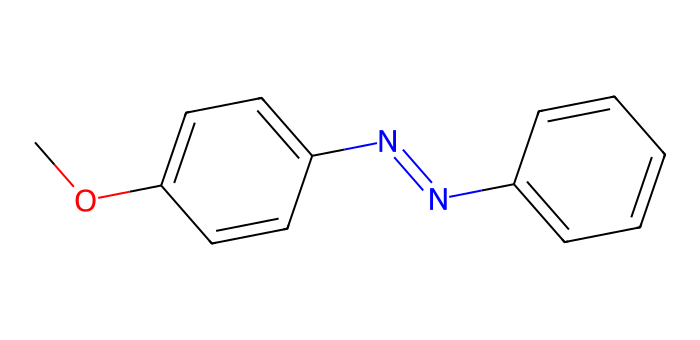
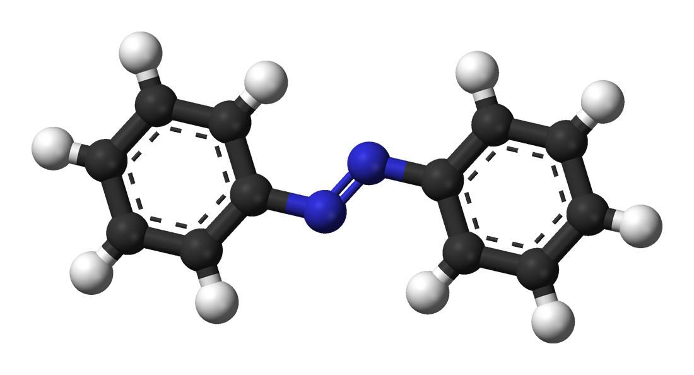

# Molekülstruktur und Isomerie

## Azobenzol {#molecular-structures}

In diesem Versuch arbeiten Sie mit dem Molekül Azobenzol.
Es besteht aus zwei Phenylgruppen, die über eine Azogruppe (–N=N–) miteinander verbunden sind.

<figure markdown="1">

<figcaption markdown="1">
Azobenzol, dargestellt als Skelettformel.
</figcaption>
</figure>

Ergänzung: Summen-, Struktur- und Skelettformeln

Azobenzol besteht aus 12 Kohlenstoff-, 10 Wasserstoff- und 2 Stickstoffatomen und besitzt somit die Summenformel
C₁₂H₁₀N₂.

In den beiden Phenylringen ist jedes Kohlenstoffatom mit zwei weiteren Kohlenstoffatomen verbunden. Je ein
Kohlenstoffatom pro Ring bindet die Azogruppe. Die übrigen Kohlenstoffatome tragen jeweils ein Wasserstoffatom.

Die genauen Bindungsverhältnisse lassen sich mit einer Strukturformel darstellen:

<figure markdown="1">

<figcaption markdown="1">
Die Strukturformel des Azobenzols.
</figcaption>
</figure>

Organische Moleküle besitzen häufig ein Grundgerüst aus Kohlenstoffatomen. In der Skelettformel werden die
Elementsymbole der Kohlenstoffatome und die daran gebundenen Wasserstoffatome zur besseren Übersicht weggelassen. Kohlenstoffatome liegen dann an den unbeschrifteten Ecken und Enden
der gezeichneten Bindungen; die gebundenen Wasserstoffatome werden so ergänzt,
dass Kohlenstoff insgesamt vier Bindungen eingeht.

## Substituenten

Als Feststoff bildet Azobenzol typischerweise orange bis orange-rote Kristalle
([Stoffdaten in PubChem](https://pubchem.ncbi.nlm.nih.gov/compound/Azobenzene)). Verdünnte Lösungen von
unsubstituiertem Azobenzol können dagegen nahezu farblos bis blassgelb erscheinen. Der Farbeindruck einer Lösung
hängt neben dem Absorptionsspektrum auch von Konzentration, Lösungsmittel und cis/trans-Verhältnis ab.

Azobenzol bildet das Grundgerüst vieler Azofarbstoffe. Durch **Substitution**, also den Austausch von
Wasserstoffatomen gegen andere Atome oder Atomgruppen, können sich Lage und Stärke der Absorptionsbanden verändern.
Substituierte Azobenzole können deshalb deutlich kräftiger gefärbt sein
([Absorptionsspektren in Methanol](https://doi.org/10.1039/C7PP00314E)). Ein Beispiel ist 4-Methoxyazobenzol:
Hier ersetzt eine Methoxygruppe (–OCH₃) ein Wasserstoffatom an Position 4.

<figure markdown="1">

<figcaption markdown="1">
Strukturformel von 4-Methoxyazobenzol.
</figcaption>
</figure>

Ergänzung: Nomenklatur

Systematische Namen beschreiben den Aufbau einer Verbindung. Die IUPAC (International Union of Pure and
Applied Chemistry) legt dafür Regeln fest. Für dieselbe Verbindung können mehrere zulässige Namen gebräuchlich sein.

Die Nummerierung der Kohlenstoffatome im Grundgerüst legt die Positionsangaben der Substituenten fest.
Beim Azobenzol werden die Kohlenstoffatome des ersten Phenylrings mit 1–6 und die des zweiten Rings mit 1′–6′
nummeriert. Die Atome 1 und 1′ sind dabei immer die beiden Kohlenstoffatome, die direkt an die Azogruppe gebunden sind.
In welcher Richtung anschließend weitergezählt wird (im oder gegen den Uhrzeigersinn) hängt normalerweise von den
vorhandenen Substituenten ab – in diesem Versuch wird zur Vereinfachung jedoch eine feste Nummerierung verwendet.

<figure markdown="1">

<figcaption markdown="1">
Die in diesem Versuch verwendete Nummerierung der Kohlenstoffatome.
</figcaption>
</figure>

Wird beispielsweise am Kohlenstoffatom 2 ein Wasserstoffatom durch ein Chloratom ersetzt, erhält man die Verbindung
2-Chlorazobenzol.

In diesem Versuch treten die folgenden Substituenten auf:

| Gruppenformel | Name des Substituenten |
|---------------|-----------------------|
| CH₃           | Methyl                |
| OCH₃          | Methoxy               |
| N(CH₃)₂       | (Dimethylamino)        |
| CF₃           | (Trifluormethyl)       |
| C≡N           | Cyano                 |
| NO₂           | Nitro                 |

Die Cyanogruppe (–C≡N) wird in der Auswahl als CN angezeigt.

H steht in der Auswahl für ein Wasserstoffatom; an dieser Position wird kein Substituent eingeführt.

Tritt ein Substituent mehrfach auf, wird dies durch Präfixe wie *di-*, *tri-* oder *tetra-* angezeigt. Wird z. B. beim
2-Chlorazobenzol zusätzlich am dritten Kohlenstoffatom des zweiten Rings ein weiteres Chloratom eingeführt, entsteht
die Verbindung 2,3′-Dichlorazobenzol.

Mit der gezeigten Nummerierung können Sie angeben, an welchen Positionen die Substituenten gebunden sind. Überprüfen Sie zur Übung, ob es
sich bei der folgenden Verbindung um 3,5-Dimethyl-4-methoxy-2′-fluor-4′-(trifluormethyl)-5′-(dimethylamino)-azobenzol
handelt:

<figure markdown="1">

</figure>

## Cis-trans-Isomerie

Durch die Azogruppe kann Azobenzol in zwei unterschiedlichen räumlichen Anordnungen (Konfigurationen) vorliegen.
Alle bisher gezeigten Strukturen entsprechen der *trans*-Form, bei der die beiden Phenylringe auf gegenüberliegenden
Seiten der Azogruppe stehen.
Bei der *cis*-Form befinden sich beide Ringsysteme auf derselben Seite.

Ergänzung: *E*,*Z*-Nomenklatur

Eine andere, systematischere Bezeichnungsweise für die Anordnung von Substituenten an Doppelbindungen verwendet die
Symbole *E* (für entgegen) und *Z* (für zusammen). In diesem Versuch werden für die beiden Konfigurationen von Azobenzol die Bezeichnungen *trans* und *cis* verwendet.

Moleküle mit gleicher Summenformel und Molekülmasse, die sich jedoch in der räumlichen Anordnung oder Verknüpfung der
Atome unterscheiden, bezeichnet man als Isomere.

<figure markdown="1">

<figcaption markdown="1">
*Cis*-Azobenzol.
</figcaption>
</figure>

Bei unsubstituiertem Azobenzol liegt die *trans*-Form energetisch tiefer als die *cis*-Form.
Ohne Bestrahlung überwiegt sie im thermischen Gleichgewicht bei Raumtemperatur.
Durch Bestrahlung mit Licht geeigneter Wellenlänge kann jedoch eine Umwandlung in die *cis*-Form ausgelöst werden.
Diese lichtinduzierte Isomerisierung bildet die Grundlage für die photoschaltbaren Eigenschaften des Moleküls.

Auch substituierte Azobenzole können durch Licht zwischen *cis* und *trans* umgeschaltet werden.
Beide Formen besitzen unterschiedliche Absorptionsspektren. Welche Mischung unter Bestrahlung entsteht,
hängt unter anderem von der Wellenlänge ab; eine vollständige Umwandlung ist nicht garantiert.

<figure markdown="1">

<figcaption markdown="1">
Die lichtinduzierte Isomerisierung des Azobenzols.
</figcaption>
</figure>

Ergänzung: Dreidimensionale Visualisierung

Chemische Strukturformeln eignen sich gut zur Darstellung grundlegender räumlicher Eigenschaften wie der
*cis*-*trans*-Isomerie, sind jedoch durch ihre zweidimensionale Darstellung begrenzt.
Abstände in einer Strukturformel sind nicht maßstabsgetreu; überlagerte Atomgruppen in der
Zeichnung müssen sich im Raum nicht überlagern.
Eine Alternative bietet die [3D-Visualisierung](https://de.wikipedia.org/wiki/3D-Visualisierung).
Sogenannte Kalotten- oder Kugel-Stab-Modelle zeigen Moleküle im Raum. Drehen Sie das Modell, um zu erkennen, welche Atome vor oder hinter der Bildebene liegen.
Das Drehen der Ansicht verändert die Molekülgeometrie nicht.

<figure markdown="1">

<figcaption markdown="1">
Kugel-Stab-Modell von trans-Azobenzol. Benjah-bmm27, Public Domain. Quelle: [Wikimedia Commons](https://commons.wikimedia.org/wiki/File:Azobenzene-trans-3D-balls.png).
</figcaption>
</figure>

